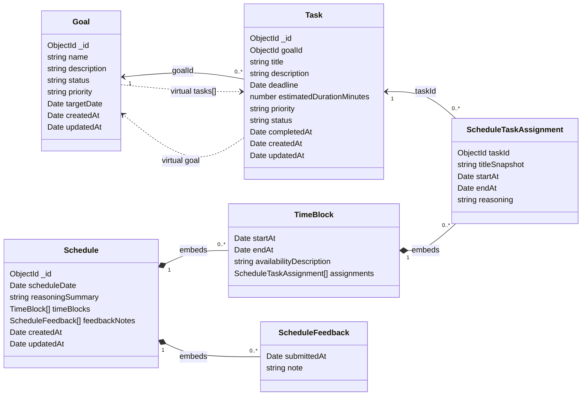

# Model Graph

This document reflects the model designs currently implemented in the codebase.

Source files:
- `models/goal.ts`
- `models/task.ts`
- `models/schedule.ts`
- `models/time-block.ts`

## Mermaid Diagram

## Notes

- `Goal`, `Task`, and `Schedule` are top-level Mongoose models.
- `TimeBlock`, `ScheduleTaskAssignment`, and `ScheduleFeedback` are embedded schemas rather than standalone collections.
- `Task.goalId` is optional, so a task can exist without a related goal.
- `ScheduleTaskAssignment.titleSnapshot` preserves the task title at scheduling time.
